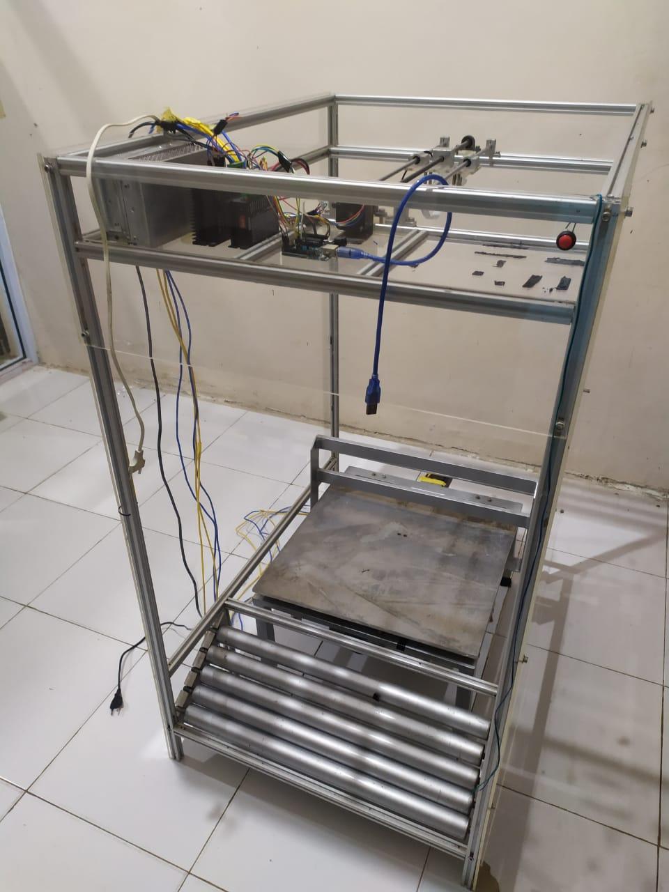
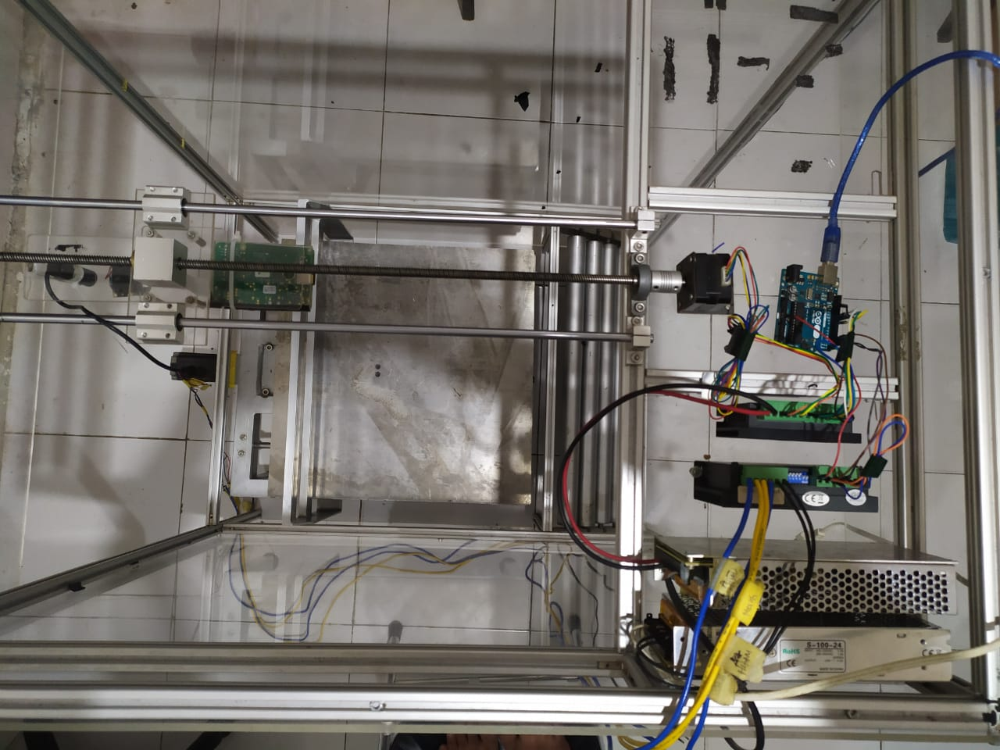

# Object Volume Detection
this is a system that can detect a symmetry object using Laser and using fracture of light to get the measurement automatically

# Requirements
* Python3+
* 2 Arduino (one to move top camera and raspberry pi, the another to move the load)
* weight sensor
* 2 current converter for arduino
* A intersection Laser
* 2 big stepper motor (to move camera and load)

## data processing
* the object will go into the black box and camera on the top will scan the object using laser.
* the image will be captured and processed using contour of that image in raspberry pi 3.
* after getting the line, the system will detect the length of each line and start using volume equation to get the volume

## control system involved
* arduino connect to 2 big stepper motor. one to run camera and raspberry pi and another to run load

# display
## from side

## from top

